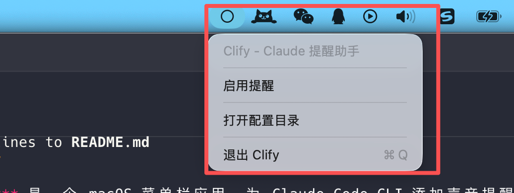

# Clify

**Clify** 是一个 macOS 菜单栏应用，为 Claude Code CLI 添加声音提醒功能。



## 功能

- 🔔 **菜单栏状态栏图标** - 简洁的界面，随时查看提醒状态
- 🔊 **空闲提醒** - Claude 空闲等待输入时播放 Glass 音效
- ⚠️ **权限请求提醒** - Claude 请求执行命令权限时播放 Funk 音效
- ✅ **命令完成提醒** - 命令执行完成时播放提示音

## 安装

### 方式 1: 下载预编译 App（推荐）

1. 从 [Releases](https://github.com/creeveliu/Clify/releases) 下载 `Clify.zip`
2. 解压并将 `Clify.app` 拖到「应用程序」文件夹
3. 首次运行时，如果提示「无法验证开发者」：
   - 右键点击 `Clify.app` → **打开**
   - 或在系统设置 → 隐私与安全性 → 仍要打开

### 方式 2: 源码编译

```bash
# 克隆仓库
git clone git@github.com:creeveliu/Clify.git
cd Clify

# 用 Xcode 打开
open Clify.xcodeproj

# 按 Cmd+R 运行
```

## 使用教程

### 1. 启动 Clify

从「应用程序」文件夹启动 Clify，菜单栏会出现图标。

### 2. 启用提醒

1. 点击菜单栏 Clify 图标
2. 选择「启用提醒」

图标状态：
- 🔔 铃铛 = 提醒已启用
- ⚪ 圆圈 = 提醒已关闭

### 3. 配置说明

启用提醒后，Clify 会自动修改 `~/.claude/settings.json` 配置文件，添加以下 hooks：

```json
{
  "hooks": {
    "Notification": [
      {
        "matcher": "idle_prompt",
        "hooks": [
          {
            "type": "command",
            "command": "afplay /System/Library/Sounds/Glass.aiff"
          }
        ]
      },
      {
        "matcher": "permission_prompt",
        "hooks": [
          {
            "type": "command",
            "command": "afplay /System/Library/Sounds/Funk.aiff"
          }
        ]
      }
    ],
    "Stop": [
      {
        "hooks": [
          {
            "type": "command",
            "command": "afplay /System/Library/Sounds/Glass.aiff"
          }
        ]
      }
    ]
  }
}
```

### 4. 禁用提醒

点击菜单栏图标 → 选择「关闭提醒」即可。

## 声音说明

| 事件 | 音效 |
|------|------|
| Claude 空闲等待输入 | Glass.aiff |
| 请求执行命令权限 | Funk.aiff |
| 命令执行完成 | Glass.aiff |

## 注意事项

- ⚠️ **仅支持 Claude Code CLI**（终端版本）
- ⚠️ **不支持 VSCode 插件**
- 需要已安装并配置 Claude Code CLI
- 配置文件路径：`~/.claude/settings.json`

## 系统要求

- macOS 12.0 或更高版本
- Claude Code CLI

## 开发

### 项目结构

```
Clify/
├── AppDelegate.swift      # 主应用逻辑
├── Assets.xcassets        # 应用图标等资源
└── Base.lproj/Main.storyboard  # 界面布局
```

### 构建命令

```bash
# Debug 构建
xcodebuild -project Clify.xcodeproj -scheme Clify -configuration Debug build

# Release 归档
xcodebuild -project Clify.xcodeproj -scheme Clify -configuration Release archive
```

## License

MIT License

## 反馈

如有问题或建议，请 [提交 Issue](https://github.com/creeveliu/Clify/issues)。
